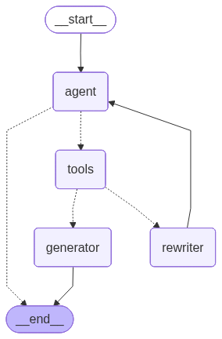

# RAG Agent

An agentic Retrieval-Augmented Generation (RAG) application built with **LangGraph** and **LangChain**. The agent autonomously decides which data source to query, grades the relevance of retrieved documents, rewrites queries when needed, and generates grounded answers.

## Architecture



The graph is compiled with **LangGraph** `StateGraph` and uses conditional edges for tool routing and document grading.

## Tech Stack

| Component | Technology |
|-----------|-----------|
| Agent Framework | LangGraph |
| LLM | Google Gemini 2.5 flash-lite (`langchain_google_genai`) |
| Embeddings | Ollama – `embeddinggemma:latest` (`langchain_ollama`) |
| Vector Store 1 | **Pinecone** – technical / cloud / ML documents |
| Vector Store 2 | **ChromaDB** – health & medicine documents |
| Web Search | Tavily Search |
| Academic Search | Arxiv |
| Config | Pydantic Settings (`.env` file) |

## Project Structure

```
rag_agent/
├── main.py                          # Entry point
├── .env                             # API keys (not committed)
├── pyproject.toml                   # Project metadata
└── app/
    ├── config.py                    # Pydantic Settings – loads .env
    ├── core/
    │   └── state.py                 # AgentState (message list with LangGraph reducer)
    ├── infrastructure/
    │   ├── llm.py                   # Gemini model initialisation
    │   ├── embeddings.py            # Ollama embeddings initialisation
    │   └── vectorstores/
    │       ├── base.py              # BaseVectorStore ABC
    │       ├── pinecone_store.py    # Pinecone implementation
    │       └── chroma_store.py      # Chroma implementation
    ├── tools/
    │   ├── retriever_tools.py       # Retriever tools (Pinecone + Chroma)
    │   ├── arxiv_tool.py            # Arxiv search tool
    │   └── tavily_tool.py           # Tavily web search tool
    ├── graph/
    │   ├── nodes.py                 # Graph nodes (agent, generator, rewriter)
    │   ├── edges.py                 # Conditional edge – document grading
    │   └── builder.py               # StateGraph wiring & compilation
    └── services/
        ├── query.py                 # ask() – public query interface
        └── ingestion.py             # Document ingestion (WIP)
```

## Setup

### Prerequisites

- **Python 3.11+**
- **Ollama** running locally with the `embeddinggemma:latest` model pulled
- API keys for **Google AI (Gemini)**, **Pinecone**, and **Tavily**

### 1. Clone the repository

```bash
git clone <your-repo-url>
cd rag_agent
```

### 2. Create a virtual environment

```bash
python -m venv .venv
# Windows
.venv\Scripts\activate
# macOS / Linux
source .venv/bin/activate
```

### 3. Install dependencies

```bash
pip install langchain langchain-core langchain-google-genai langchain-ollama \
            langchain-pinecone langchain-chroma langchain-classic \
            langgraph pinecone pydantic-settings tavily-python arxiv
```

### 4. Configure environment variables

Create a `.env` file in the project root:

```env
GOOGLE_API_KEY=your-google-api-key
PINECONE_API_KEY=your-pinecone-api-key
TAVILY_API_KEY=your-tavily-api-key
```

### 5. Start Ollama (if not already running)

```bash
ollama pull embeddinggemma:latest
ollama serve
```

## Usage

### Run from the command line

```bash
python main.py
```

### Use programmatically

```python
from app.services.query import ask

answer = ask("What are the health benefits of eating tomatoes?")
print(answer)
```

### Change the question

Edit `main.py` or call `ask()` with any question. The agent will automatically route to the appropriate data source:

- **Health / medicine questions** → Chroma retriever
- **Cloud / ML / technical questions** → Pinecone retriever
- **Academic / research questions** → Arxiv
- **General web questions** → Tavily

## How It Works

1. **Agent node** receives the user question and decides which tool(s) to invoke via Gemini's tool-calling capability.
2. **Tool node** executes the selected retriever / search tool and returns documents.
3. **Grade documents** edge evaluates whether the retrieved content is relevant using structured LLM output (`yes` / `no`).
4. If **relevant** → the **Generator** node produces a grounded answer from the context.
5. If **not relevant** → the **Rewriter** node reformulates the question and loops back to the Agent.

## Design Decisions

- **BaseVectorStore ABC** – a common interface (`add_documents`, `as_retriever`) makes it easy to swap or add new vector stores without changing tool or graph code.
- **Pydantic Settings** – all configuration is centralised in `config.py` and loaded from `.env`, keeping secrets out of source code.
- **Layered architecture** – config → infrastructure → tools → graph → services → main. Each layer only imports from layers below it, preventing circular dependencies.

## License

MIT
